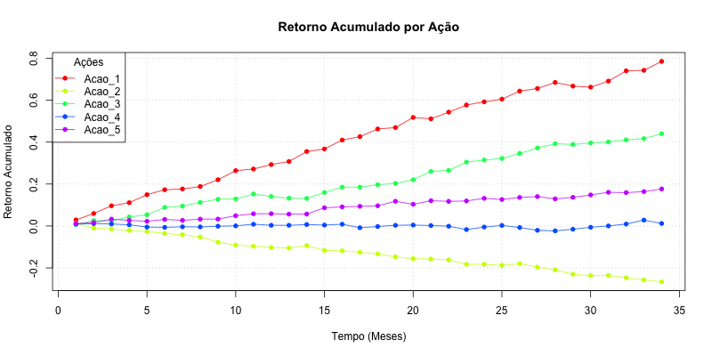

```{r setup,results='hide',warning=FALSE,echo=FALSE,message=FALSE}
# A few initial definitions just to make sure all required packages are installed. Change as needed.
# NOTE: It may echo some weird messages to the PDF on the first compile (package installation messages). Run twice and the problem will (hopefully) go away.
if (!require(ggplot2, quietly = TRUE)){
      install.packages("ggplot2",quiet = TRUE)
      }
if (!require(devtools, quietly = TRUE)){
      install.packages("devtools",quiet = TRUE)
      }
 if (!require(broom, quietly = TRUE)){
       devtools::install_github("dgrtwo/broom",quiet = TRUE)
      }
# if (!require(GGally, quietly = TRUE)){
#       install.packages("GGally")
#       }
if (!require(dplyr, quietly = TRUE)){
      install.packages("dplyr",quiet = TRUE)
}
if (!require(reshape2, quietly = TRUE)){
      install.packages("reshape2",quiet = TRUE)
}
if (!require(multcomp, quietly = TRUE)){
      install.packages("multcomp",quiet = TRUE)
}
if (!require(car, quietly = TRUE)){
      install.packages("car",quiet = TRUE)
}
```
## Resumo
Este estudo de caso realiza a análise de um conjunto de 5 ações sobre um período de 36 meses para avaliar por meio das taxas de retorno e do teste ANOVA a melhor ação para obter a melhor rentabilidade no próximo mês. 

## 1. Design do Experimento

Para realizar a análise estatística, estabelecemos as seguintes hipóteses:

- **Hipótese Nula (\(H_0\))**: Não existe diferença no valor médio dos retornos das ações, isto é, não existe diferença no tamanho dos efeitos $\tau_i$.

$$\begin{cases} H_0: \tau_i = 0, \ \forall i \in \{1,2,...,a\}\end{cases}$$

- **Hipótese Alternativa (\(H_a\))**: Existe ao menos uma ação com um efeito significativamente diferente de zero, ou seja, com um retorno médio mensal superior às demais.

$$\begin{cases} H_1: \exists \ \tau_i \neq 0 \end{cases}$$

Para testar a hipótese definida, será utilizado o teste ANOVA. Se decidirmos pela rejeição da hipótese nula e as premissas do teste ANOVA forem validadas, precisaremos determinar quais ações possuem retorno significamente maior do que as demais. Para isso, vamos realizar comparações múltiplas para identificar quais pares de ação diferem significativamente, utilizando o método de Tukey.

### 2. Descrição do conjunto de dados

Os dados utilizados neste estudo são referentes aos preços de fechamento de cinco ações, extraídos de um arquivo CSV. Cada arquivo contém 36 linhas e 5 colunas, onde:

- Cada linha representa o preço de fechamento mensal das ações, com a linha 1 correspondendo ao mês mais recente e a linha 36 ao mês mais distante.
- Cada coluna representa uma das cinco ações analisadas.
- O conteúdo da posição (i, j) refere-se ao preço de fechamento da ação j no mês i.

Com base nesse conjunto de dados, foi calculado o retorno mensal de cada ação utilizando a fórmula:

\[
\text{Retorno} = \frac{\text{Preço no mês atual} - \text{Preço no mês anterior}}{\text{Preço no mês anterior}}
\]

Posto que o retorno do investimento depende do preço anterior, o primeiro mês da série temporal não terá um valor para o retorno do investimento. Isto é, o 36º mês da série, por não haver informação anterior a ele, não terá valor definido. Logo, o resultado é uma tabela com 35 retornos mensais para cada uma das cinco ações.


```{r loaddata}
# Ler o arquivo CSV com os preços de fechamento das ações
precos <- read.csv("DadosAcoesGrupoH.csv", header=FALSE)
colnames(precos) <- paste0("Acao_", 1:5)

# Calcular o retorno mensal de cada ação
# Retorno mensal = (Preço atual - Preço anterior) / Preço anterior
retornos <- precos
for (j in 1:ncol(precos)) {
  for (i in 2:(nrow(precos))) {
    retornos[i-1, j] <- ((precos[i-1, j] - precos[i, j])) / precos[i, j]
  }
}

# Remover a ultima linha, porque a primeira linha da tabela de preços foi descartada
retornos <- retornos[-36, ]
```


## 3. Análise Exploratória

Antes de realizar os testes de hipótese, foi realizada uma análise exploratória para obter uma visão geral dos dados.

Primeiro analisou-se os dados dos retornos temporalmente, do mês mais antigo até o mês atual conforme o gráfico abaixo.


Observa-se não é trivial a análise dos ganhos mês a mês dado o volume de informações e a impossibilidade de compará-los de forma analítica. Logo, foi feita uma análise do ganho acumulado por ação.



Nesta nova análise, observa-se que há indícios de ações melhores que as outras para investimento ao longo dos 36 meses. A ação 1 por exemplo, teve um ganho acumulado de $80\%$. Entretanto, ainda não é possível afirmar com certeza qual a melhor ação para investimento no próximo mês. 

A Figura \@ref{fig:boxplot} fornece um boxplot para comparar as distribuições dos retornos das ações.

```{r boxplot,fig.width=8,echo=TRUE,message=FALSE,fig.cap="Retorno das Ações (dados originais + boxplots)"}

# Transforma os dados para visualização
retornos_melt <- melt(retornos, variable.name = "Acoes", value.name = "Retorno")

# Boxplot dos retornos
ggplot(retornos_melt,
       aes(x = Acoes, y = Retorno, fill = Acoes)) +
    geom_boxplot() +
    geom_point( alpha = 0.5) +
    ggtitle("Retorno das Ações",
            "(dados originais + boxplots)") +
    theme(legend.position = "none")
```

A análise gráfica indica que a Ação 1 aparenta apresentar o maior retorno médio entre as ações analisadas. De todo modo, é necessária uma análise estatística para corroborar ou não com este entendimento com uso de ferramentas que endossem a decisão da ação a ser investida. 


## 4. Análise Estatística

Para validar nossas observações iniciais, realizamos um teste ANOVA para avaliar as diferenças nos retornos das ações.

```{r fitmodel,results='hold'}
retornos_melt$Acoes <- as.factor(retornos_melt$Acoes)
model <- aov(Retorno ~ Acoes, data = retornos_melt)
summary(model)
```

Como resultado do teste, obteve-se uma estatística F = 34,45 e um p-valor < 2e-16. 

Diante do resultado do teste ANOVA, podemos rejeitar, com nível de significância $\alpha = 0,05$, a hipótese nula de que as médias de retorno das cinco ações são iguais.

Esse resultado indica que nem todas as ações têm retornos médios semelhantes e, para identificar quais ações possuem maior retorno médio, realizamos um teste de Tukey, da forma de todos contra todos. Com 5 graus de liberdade - número de ações em análise, o teste de Tukey da forma todos contra todos proverá 10 análises comparativas entre as ações. Seus resultados são mostrados na Figura \@ref{fig:turkey}.

```{r turkey,results='hold',fig.width=8,echo=TRUE,message=FALSE,fig.cap="Comparações múltiplas - Turkey"}
# Comparações múltiplas
library(multcomp)

mc1    <- glht(model, 
               linfct = mcp(Acoes = "Tukey"))
summary(mc1)
mc1_CI <- confint(mc1, level = 0.95)

par(mar = c(5, 10, 4, 2)) # margens
plot(mc1_CI, 
     xlab       = "Retornos",
     cex.axis   = 1.2,
     cex        = 2,
     main = "Comparações Múltiplas - Tukey")
```


Quando comparadas as ações 1 com 3, 5 com 3 e 5 com 4 observa-se a inclusão do zero no intervalo de confiança que indica que elas podem obter o mesmo retorno quando comparadas uma com as outras. Pontua-se também que é importante analisar de forma absoluta a diferença das médias das ações.

Portanto, as comparações mais significativas são entre a Ação 1 com todas por exceto com a ação 3, todas com p-valor < 0,001, indicando que essa ações têm média de retorno significativamente diferente. Ambas estas ações tiveram um retorno positivo ao longo do período analisado, diferentemente da Ação 2. Comparando-se as Ações 3 com 1, nota-se também um grau de significância menor, entre 0.05 e 0.1, o que nos indica que suas médias são próximas. Entretanto, avalia-se que o retorno absoluto em termos percentuais da ação 1 é maior que os da ação 3, conforme esperado na análise exploratória dos dados. 

Confirmando a suspeita inicial, o teste de Tukey indica que a Ação 1 tem o maior retorno médio entre as ações analisadas, visto que as comparações entre a Ação 1 e as outras Ações todas mostram diferenças significativas e que ela possui um retorno absoluto maior que a Ação 3. 

### 4.1 Poder do Teste

Para o poder do teste, foram utilizados os valores de $\alpha = 5\%$ e $\beta = 5\%$. Para 5 grupos, um número de amostras $n = 35$, referente aos retornos em 36 meses e variância e desvio-padrão calculados, obtêm-se um poder de teste suficientemente grande para validar a rejeição da hipótese nula. 

Analisando o número mínimo de amostras para obter um poder de teste estipulado como suficiente, de $95\%$, o número mínimo de amostras seria de 6 amostras de retornos, ou seja 7 meses de fechamento das ações dos 5 grupos. 

O poder do teste no ANOVA nos diz respeito à probabilidade de rejeitar a hipótese nula quando a hipótese alternativa é verdadeira. Dado que existe diferença significativa entre as médias dos retornos das ações, esta análise corrobora com os resultados obtidos. 

```{r poder,results='hold'}
alpha<-0.05
beta<-0.05
vartau <- var(retornos_melt[,2])
sigma<-sd(retornos_melt[,2])

power.anova.test(
  groups = 5,
  between.var = vartau,
  within.var = sigma^2, 
  sig.level = alpha,
  n=35)

power.anova.test(
  groups = 5,
  between.var = vartau,
  within.var = sigma^2, 
  sig.level = alpha,
  power=1-beta)

```

### 5. Verificação das Premissas do Modelo

Para validar a rejeição de $H_0$, precisamos validar as premissas do teste do ANOVA. Presume-se a independência entre as séries temporais, a igualdade da variância entre os grupos (homoscedasticidade) e a normalidade de  distribuição dos resíduos do teste. 

A variação das ações em uma bolsa de valores depende de fatores internos às empresas mas também de fatores externos. Esses fatores podem afetar ou não o conjunto das ações. A aleatoriedade o entendimento de que são empresas diferentes, controlados por grupos econômicos diferentes endossa a premissa de indepencência entre o comportamento das ações.

Podemos analisar estatisticamente a independência dos resíduos do modelo por meio do teste de Durbin-Watson. 

```{r durbinWatson,results='hold'}
durbinWatsonTest(model)
```

O resultado do teste nos dá uma Estatística Durbin-Watson de 2,28, muito próxima de 2 com um p-valor de $13,8\%$. Por definição, a proximidade da estatísica DW próximo a 2 nos indica a independência dos resíduos. Conforme a saída do teste, não podemos rejeitar a hipótese nula. Isto é: não há autocorrelação de primeira ordem no modelo.

O segundo passo foi analisar a normalidade dos resíduos. Para tal, foi utilizado o teste de Shapiro-Wilk e análise gráfica dos resíduos.

```{r resplots,fig.width=20,fig.height=10,fig.align='center',echo=TRUE,message=FALSE, fig.cap = "QQPlot dos resíduos"}
par(mfrow=c(2,2), mai=.3*c(1,1,1,1))
plot(model,pch=16,lty=1,lwd=2)


shapiro.test(model$residuals)

# qqp<-qqPlot(model$residuals, 
#        pch = 16, 
#        lwd = 3, 
#        cex = 2, 
#        las = 1,
#        main = "Análise Gráfica da Normalidade dos Resíduos do modelo ANOVA")
# png("graficos/qqPlot_anova_residuos2.png", width = 800, height = 400)
# qqPlot(anova$residuals, pch = 16, lwd = 3, cex = 2, las = 1,
#        xlab = "Quantis", ylab = "Resíduos")
# dev.off()

```


O teste de Shapiro-Wilk nos fornece um resultado da estatística $W = 0.99337$ e p-valor de $61,36\%$. Isso nos indica que os resíduos encaixam muito bem sobre uma distribuição normal com p-valor superior a $5\%$. Pela análise gráfica, podemos observar que os resíduos de fato tem um comportamento bem ajustado em torno de uma distribuição normal, até mesmo as amostras mais distantes de seu centro. Logo, por meio destas análises podemos validar a premissa da normalidade dos resíduos do modelo. 

Para validar a premissa da homoscedasticidade fo irealizado o teste de Fligner-Killen. 

```{r fligner,results='hold'}
fligner.test(Retorno ~ Acoes, data = retornos_melt)
```
O resultado deste teste nos informa que com um p-valor de $2,14\%$ devemos rejeitar a hipótese nula de que as variâncias em cada um dos grupos é a mesma. Logo este teste não nos confirma a igualdade da variância entre os grupos.

Aprofundando a análise, o p-valor de $2,14\%$ para o Fligner-Killeen nos pode indicar uma violação não acentuada da igualdade das variâncias. 

Seguindo para uma análise do gráfico dos resíduos pelos valores ajustados podemos observar que o comportamento de cada um dos grupos demonstra um comportamento similar para as amostras. Caso escolhamos uma amostra aleatória de qualquer um dos grupos, não podemos afirmar com certeza de qual dos grupos essa amostra pertence. 

```{r analisevariancias,results='hold'}

plot(x = model$fitted.values, y = model$residuals, xlab = c("Ações"), ylab="Valores",xaxt='n')
```

Logo, apesar do teste de Fligner-Killeen não acusar homoscedasticidade, podemos afirmar que essa violação é moderada posto que as observações dos grupos são balanceadas. Sabendo que o teste ANOVA é robusto a tais violações moderadas da variância entre os grupos, podemos manter a validação da premissa da homoscedasticidade, validando nossa análise. 


### 6. Conclusões e Recomendações

Foi realizado um teste ANOVA com 5 ações no período de 36 meses e 35 dados sobre os retornos mensais. Foi realizada uma análise de Tukey para a decisão da escolha da melhor ação para investimento no próximo mês. Observou-se que a melhor ação é a 1. A ação 3 é marginalmente pior porém em termos percentuais, a 1 provém maiores ganhos historicamente. Não indica-se a compra da ação 2 posto que ela vem apresentando perdas acumuladas. As outras ações apresentam ganhos menores. Validou-se as premissas do ANOVA por meio dos teste de Shapiro-Wilk para os resíduos, Fligner-Killeen para a homoscedasticidade e o teste de Durbin-Watson para a independência dos resíduos. Embora o teste de Fligner-Killeen não ter comprovado a a igualdade da variância entre os grupos diretamente, observou-se que essa violação é moderada e podemos manter a premissa da homoscedasticidade.

Como recomendações, sugere-se para melhorar o experimento reduzir o período de análise das ações. Foi visto no poder to teste que um período com 7 fechamentos é suficiente para detectar uma rejeição da hipótese nula com $95\%$ de certeza. Um período de 36 meses é muito maior e pode levar a decisões incorretas do investimento ideal posto que uma quantidade maior de amostras pode mascarar oscilações sazonais e que podem reduzir os retornos. Observou-se que para as ações analisadas, não houve inversão do retorno acumulado, isto é, em um determinado momento com um número de amostras muito grande (período de análise muito longo), uma ação que apresentava ganhos pode começar a gerar prejuízos a curto prazo. 

### 7. Atividades Específicas

- Ana Julia: Design do experimento, análise estatística, análise exploratória e descrição do conjunto de dados (redação e código) 
- Antônio: Análise do Experimento, análise estatística, validação das premissas, conclusões e recomendações, revisão do relatório e dados. 
- Melchior: Verificação das premissas, análise estatística, revisão do relatório e dados, conclusões e recomendações. 